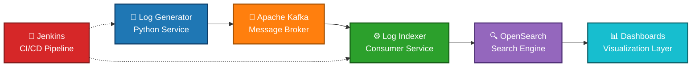

# 🚀 Nexus-Ops: Real-Time Data Pipeline & CI/CD Automation

Nexus-Ops is an **end-to-end DevOps and Data Engineering platform** that simulates a production-grade real-time data pipeline, autonomous CI/CD processes, and containerized microservice orchestration.

The system demonstrates how modern organizations ingest, process, index, and visualize high-volume log data in real time while maintaining a fully automated deployment workflow.
---

## 🌍 Overview

This project replicates a **real-world enterprise log processing architecture**, covering:

- Real-time data streaming
- Distributed message processing
- Search and analytics indexing
- Live operational dashboards
- Autonomous CI/CD automation

It is designed to showcase both **Data Engineering** and **DevOps** competencies within a single cohesive ecosystem.

---

## 🧩 System Architecture Diagram



### Core Flow

1. Log Generator microservice produces structured log events  
2. Kafka acts as the distributed event streaming platform  
3. Log Indexer consumes Kafka messages and indexes them  
4. OpenSearch stores and analyzes indexed logs  
5. Dashboards visualize logs in real time  
6. Jenkins automates build and deployment pipelines  

---

## 🧰 Technology Stack

| Layer | Technology | Purpose |
|------|-------------|--------|
| Message Broker | Apache Kafka + Zookeeper | Distributed event streaming |
| Search Engine | OpenSearch | Log storage and analytics |
| Visualization | OpenSearch Dashboards | Real-time monitoring |
| CI/CD | Jenkins | Autonomous pipeline execution |
| Microservices | Python | Log generation and indexing |
| Containerization | Docker & Docker Compose | Environment orchestration |

---

## 📂 Project Structure

```
nexus-ops/
├── docker-compose.yml            # Multi-service container orchestration
├── Jenkinsfile                   # CI/CD pipeline definition
│
├── services/
│   ├── log-generator/            # Produces structured log events
│   │   ├── main.py
│   │   └── requirements.txt
│   │
│   └── log-indexer/              # Consumes Kafka and indexes logs
│       ├── main.py
│       └── requirements.txt
│
├── dashboards/
│   └── dashboard.ndjson          # Preconfigured OpenSearch dashboard
│
└── assets/
    ├── dashboard.png             # OpenSearch visualization screenshot
    └── jenkins.png               # Jenkins pipeline screenshot
```

---

## ✨ Key Features

### 🔁 Real-Time Data Streaming

- Python microservices generate structured log messages
- Apache Kafka distributes messages across topics
- Ensures decoupled, scalable data ingestion

---

### 📥 Data Ingestion & Indexing

- Dedicated Kafka consumer microservice
- Parses and indexes logs into OpenSearch
- Enables full-text search and analytics in real time

---

### 📊 Live Monitoring Dashboard

- Custom OpenSearch Dashboards
- Tracks:
  - Log levels (INFO, WARN, ERROR)
  - Service performance metrics
  - Error distribution trends

---

### 🤖 Autonomous CI/CD Pipeline

- Jenkins pipeline configured with:
  - **Webhook trigger** or **PollSCM**
- Automatically:
  - Pulls latest code
  - Builds containers
  - Simulates deployment stages

No manual intervention required.

---

## 📸 Proof of Work

### 🖥️ Real-Time Command Center (OpenSearch Dashboards)

Live monitoring of system logs and service health.


---

### ⚙️ Autonomous CI/CD Pipeline (Jenkins)

End-to-end automated pipeline triggered by GitHub commits.


---

### 💻 Real-Time Data Streaming (Kafka & Python)
Python-based microservices generate structured log data and stream it into Apache Kafka topics in real time.  
This demonstrates an event-driven architecture where producers continuously send data and consumers process it asynchronously.


---

## ☸️ Cloud-Native Kubernetes (k8s) Deployment

The project is extended into a fully **cloud-native, production-style architecture** using Kubernetes.  
All components are deployed into an isolated namespace with internal service discovery and scalable orchestration.

---

### 🧱 1. Create the Dedicated Namespace

```
kubectl apply -f k8s/namespace.yaml
```

This creates an isolated environment (`nexus-ops`) where all resources will be deployed and managed independently.

---

### 📡 2. Deploy Core Infrastructure (Data & Messaging Layer)

```
kubectl apply -f k8s/zookeeper.yaml
kubectl apply -f k8s/kafka.yaml
kubectl apply -f k8s/opensearch.yaml
kubectl apply -f k8s/opensearch-dashboards.yaml
```

This step provisions:

- **Zookeeper** → Kafka cluster coordination  
- **Apache Kafka** → Distributed event streaming  
- **OpenSearch** → Log indexing and storage  
- **Dashboards** → Visualization layer  

All services communicate internally within the Kubernetes cluster.

---

### 🔍 3. Verify Cluster Status

```
kubectl get pods -n nexus-ops
```

Expected result:

- All pods should be in **Running** state  
- Services should be properly initialized  
- No crash loops or pending states  

---

### ⚙️ 4. (Optional) Deploy Application Services

If you have Kubernetes manifests for microservices:

```
kubectl apply -f k8s/log-generator.yaml
kubectl apply -f k8s/log-indexer.yaml
```

This enables full pipeline execution directly inside Kubernetes.

---

### 🌐 5. Access Services (Port Forward)

```
kubectl port-forward svc/opensearch-dashboards 5601:5601 -n nexus-ops
```

Then open:

```
http://localhost:5601
```

---

### 🧠 What This Phase Demonstrates

- Kubernetes-based service orchestration  
- Namespace isolation  
- Internal service networking  
- Scalable, container-native deployment  
- Transition from local Docker setup → cloud-native architecture  


---

### 🐳 Containerized Infrastructure (Docker)
All system components (Kafka, OpenSearch, Jenkins, and microservices) are containerized using Docker.  
This ensures isolated, reproducible, and scalable environments, enabling consistent behavior across development and deployment stages.


---


## 🚀 Running the Project Locally

### ⚙️ Prerequisites

- Docker & Docker Compose
- Python 3.9+
- Git

---

## 1️⃣ Clone the Repository

```
git clone https://github.com/YOUR_USERNAME/nexus-ops.git
cd nexus-ops
```

---

## 2️⃣ Start the Infrastructure

This command launches:

- Kafka & Zookeeper
- OpenSearch
- OpenSearch Dashboards
- Jenkins

```
docker-compose up -d
```

---

## 3️⃣ Run the Microservices

Open **two separate terminal windows**.

### Terminal 1 — Log Generator

```
cd services/log-generator
python -m venv venv
source venv/bin/activate
pip install -r requirements.txt
python main.py
```

---

### Terminal 2 — Log Indexer

```
cd services/log-indexer
python -m venv venv
source venv/bin/activate
pip install -r requirements.txt
python main.py
```

---

## 🌐 Accessing the Interfaces

| Service | URL |
|--------|------|
| OpenSearch Dashboards | http://localhost:5601 |
| Jenkins | http://localhost:8080 |
| Kafka | localhost:9092 |

---

## 🔄 CI/CD Workflow

1. Developer pushes code to GitHub
2. Jenkins detects changes via webhook
3. Pipeline stages execute automatically:
   - Checkout
   - Build
   - Test (simulated)
   - Deployment (simulated)

This demonstrates a **fully autonomous DevOps pipeline**.

---

## 🧠 Key Engineering Concepts Demonstrated

- Event-driven architecture
- Stream processing
- Distributed systems
- Search indexing pipelines
- CI/CD automation
- Containerized infrastructure

---

## 👨‍💻 Developer

**Ali Gaffar Toksoy**  
Computer Engineering Student  

Interests:
- DevOps Engineering
- Data Engineering
- Distributed Systems

> “Production systems are not just about writing code — they are about designing reliable data flows.”

---
